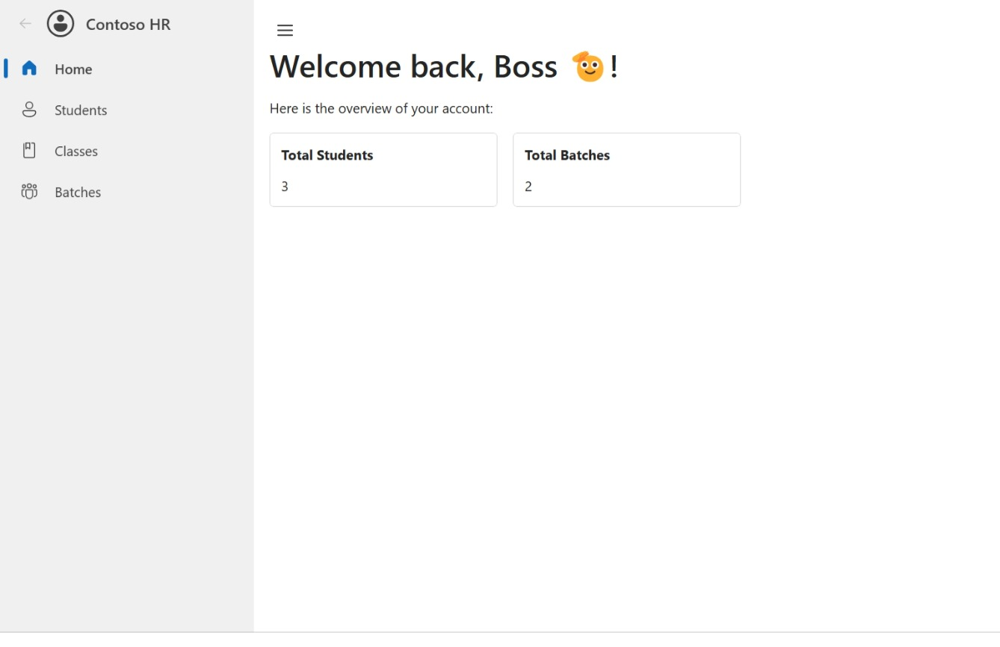
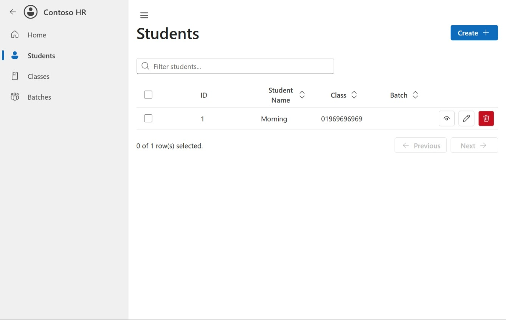
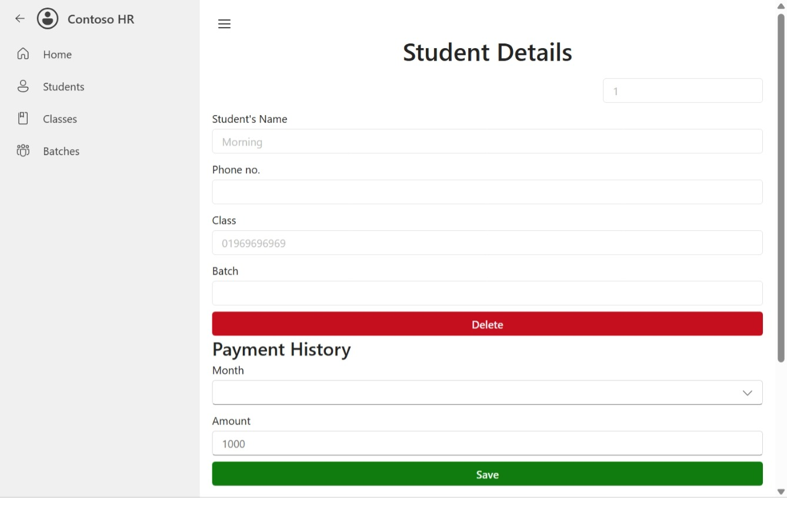
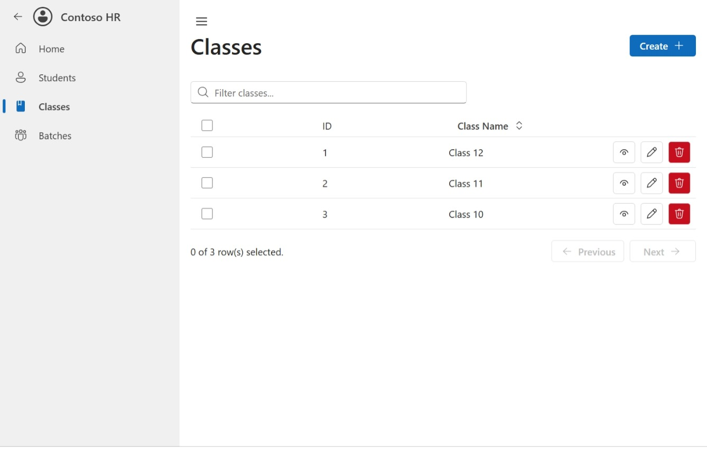
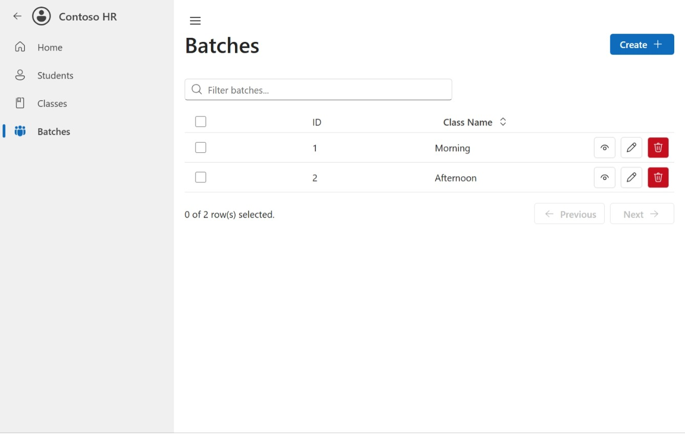

# Tutoring Institution Management System

Welcome to the Tutoring Institution Management System, a Tauri-based application designed to help small coaching and tutoring institutions manage and track their students' records efficiently.

## Features

- [x] **Student Management**: Add, update, and view student details including name, phone number, class, and batch.
- [x] **Batch Management**: Organize students into different batches such as Morning and Afternoon.
- [x] **Class Management**: Manage different classes like Class 10, Class 11, and Class 12.
- [x] **Payment Tracking**: Keep track of students' payment history.
- [x] **Dashboard Overview**: View the total number of students and batches at a glance.
- [ ] **Attendance Tracking**: Record and monitor student attendance.
- [ ] **Exam Results**: Manage and track student exam results.
- [ ] **Teacher Management**: Add and manage teacher details and assignments.
- [ ] **Report Generation**: Generate reports for students, batches, and payments.
- [ ] **User Authentication**: Implement login and user roles for secure access.
- [ ] **Notifications**: Send reminders for payments and important dates.
- [ ] **Data Export**: Export student and payment data to CSV or PDF.

## Screenshots

### Dashboard Overview



### Student Management



### Student Details



### Class Management



### Batch Management



## Installation

To get started with the Tutoring Institution Management System, follow these steps:

1. **Clone the repository**:

   ```bash
   git clone https://github.com/devrayat000/student-management.git
   cd student-management
   ```

2. **Install dependencies**:

   ```bash
   bun install
   ```

3. **Run the application**:

   ```bash
   bun tauri dev
   ```

## Usage

1. **Dashboard**: View the total number of students and batches.
2. **Students**: Add and manage student records.
3. **Classes**: Organize students into different classes.
4. **Batches**: Assign students to morning or afternoon batches.
5. **Payment History**: Track monthly payments for each student.

## Contributing

Contributions are welcome! Please fork the repository and submit a pull request with your changes.

## License

This project is licensed under the MIT License - see the [LICENSE](LICENSE) file for details.

## Acknowledgments

- Tauri for providing a robust framework for building desktop applications.
- All contributors and users for their valuable feedback and support.

---

Feel free to explore the system and provide feedback to help us improve!
